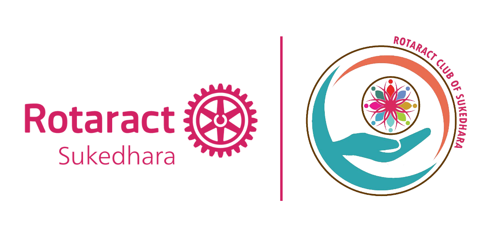

# Rotaract Club of Sukedhara Website

<!-- Replace the placeholder below with the official club logo -->


## Rotaract Club of Sukedhara

**Club ID:** 217232  
**Rotary International District:** 3292 🇳🇵 🇧🇹 *(Nepal–Bhutan)*  
**Zone:** 7  
**Chartered On:** 1st July, 2019  
**Sponsored By:** [Rotary Club of Nagarjun](https://rcnagarjun.org)

</div>

---

## About the Club

The **Rotaract Club of Sukedhara** is a community of young leaders committed to creating positive change through service, professional development, and fellowship.

Operating under **Rotary International District 3292 (Nepal–Bhutan)**, the club actively organizes projects and initiatives focused on community impact, leadership growth, and meaningful engagement among youth.

---

## About This Website

This repository contains the source code for the official website of the **Rotaract Club of Sukedhara**.

The website serves as a digital platform to:

- Showcase the club's projects and activities
- Highlight club achievements and milestones
- Share announcements and updates
- Provide information about the club and its members
- Preserve the club's history and legacy
- Facilitate engagement with members, alumni, and the wider community

---

## Built With

This website is built using:

- **Next.js**
- React
- TypeScript
- Modern web development practices

---

## Open Source Contributions

We believe that technology and service go hand in hand.

This website is **open source**, and club members with a passion for technology are encouraged to actively contribute to its development and improvement.

Whether you're experienced in web development or just beginning your journey in tech, your contributions are welcome.

You can contribute by:

- Fixing bugs
- Improving accessibility and performance
- Designing new features
- Enhancing the user experience
- Updating content and documentation
- Reviewing code and submitting suggestions

Together, we can build and maintain a website that reflects the spirit, professionalism, and service ideals of our club.

---

## Getting Started

Clone the repository:

```bash
git clone <repository-url>
````

Navigate into the project directory:

```bash
cd <repository-name>
```

Install dependencies:

```bash
npm install
```

Run the development server:

```bash
npm run dev
```

Open your browser and visit:

```text
http://localhost:3000
```

---

## Contributing

Contributions are welcome from all members of the Rotaract Club of Sukedhara.

Please feel free to fork the repository, create a feature branch, and submit a pull request.

Let's build something meaningful together.

---
## License

This project is licensed under the **MIT License**.

You are free to use, modify, distribute, and sublicense this software, provided that the original copyright notice and license are included in all copies or substantial portions of the software.

See the [LICENSE](LICENSE) file for the full license text.

---

**Service Above Self • Fellowship Through Service • Leadership Through Action**

Made with ❤️ by the members of the Rotaract Club of Sukedhara.

